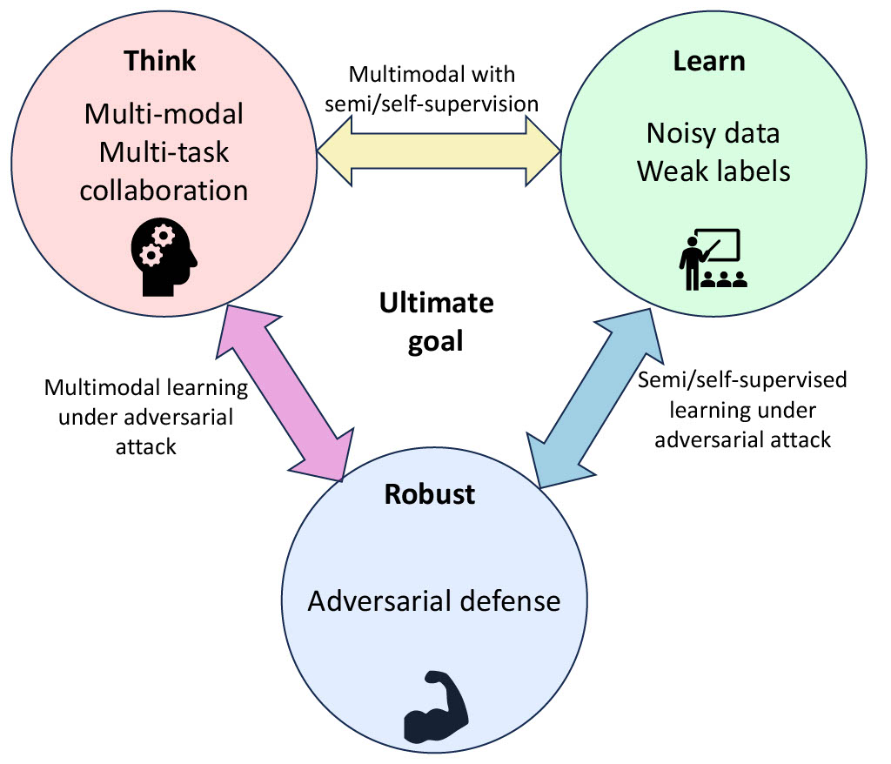

## Education

- **Sep 2021 - Dec 2022:** M.S. in Operations Research, Columbia University
- **Sep 2017 - June 2020:** B.S. in Applied Math, University of California, San Diego

 

## Research Interests

My ultimate research goal is to build a leraning-based intelligent systems that can percieve the visual world at human levels, whcih can *understand different modalities, perform different tasks, and collaborate with others*. To achieve this, I break my research down to three sections: **think** like humans, **learn** like humans, and **robustness** of the intellegent systems, as shown in the image on the right. My previous work focused on how to **think**, including robust and effective method for multi-agent collaboration in VPR, SE-(3) equivariant understanding of point clouds, LLM's supervision for OCR, and time series understanding. Currently, I am working on multi-modalities.

My next step is to continue exploring how to **think**, developing a multi-modal model that can collaborate with others and generalize its ability to different but relevant tasks. In addition, **learning** with imperfect, noisy, and weakly labeled data is important to enhance the capability of intelligent systems as most real-world data are not perfectly cleaned. After developing a sophosticated system, it is important to take **robustness** into consideration for real-world deploment.

In short, my current reasearch intersts are:
* Computer vision
* Multi-modal, cross-modal, and/or multi-task learning
* Collaborative systems
* Deep Learning

#### Contact
If you have any questions, please email to zonglinlyu123123@gmail.com

 

## About

In the past year, I worked at [AI4CE Lab](https://ai4ce.github.io/) with [Yiming Li](https://scholar.google.com.hk/citations?user=i_aajNoAAAAJ&hl=zh-CN), supervised by [Professor Chen Feng](https://scholar.google.com/citations?user=YeG8ZM0AAAAJ&hl=en) who specializes in robotics and computer vision research.

At AI4CE, I worked on Collaborative Visual Place Recognition (CoVPR). In this work, I formulated the first CoVPR framework and designed a novel algorithm that balances noises and extra information from collaborators. The method is robust, effective, and easy to implement. I am excited about the future impact of this work. Details can be found in [this paper](https://arxiv.org/abs/2310.05541).

Beyond this work, I am currently working on three projects:
1.    Improvements and extensions on CoVPR, resolving limitations and designing new mechanisms.
2.    Benchmarking a large-scale autonomous driving dataset. The paper is coming soon!
3.    Developing methods for multi-modal learning.

 

## Selected Publications

 
---

## News and Updates
- **Sept. 2023：** One paper has been submitted to **ICRA 2024**.
- **Jan. 2023：** Joined AI4CE Lab.
- **Sept. 2022：** One paper has been accepted to **ICTAI 2022**.

 

