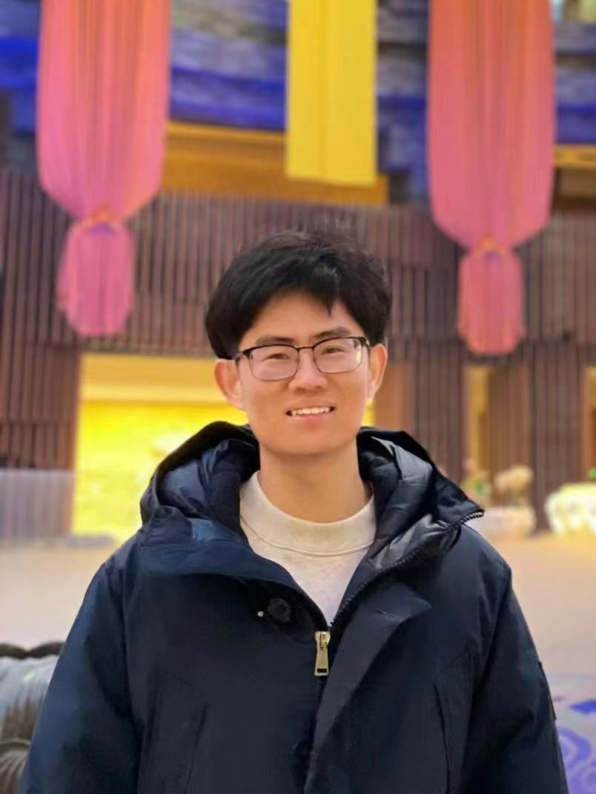

# Zonglin Lyu

## About

I graduated from University of California San Diego with a Bachelor's degree in Applied Math and from Columbia University with a Master's degree in Operations Research. In the past year, I worked at [AI4CE Lab](https://ai4ce.github.io/), supervised by [Professor Chen Feng](https://scholar.google.com/citations?user=YeG8ZM0AAAAJ&hl=en) who expertised in robotics and computer vision.

At AI4CE, I worked on Collborative Visual Place Recognition (CoVPR). It is a wonderful experience to discuss and collaborate with Professor Chen Feng and several labmates. In this work, I formulated the first CoVPR framework and designed a novel algorithm which is robust (in distance between vehicles), effective (outperforming sing-agent systems and methods such as average pooling), and easy to implement (no complicated computation), and therefore it is directly applicable to real-world VPR systems. I am excited about the future impact of this work. Details can be found in [this paper](https://arxiv.org/abs/2310.05541).

Beyond this work, I am currently working on three projects:
1.    Improvements and extensions on CoVPR. We encountered some limitations and constraints, and therefore I am resolving them and bringing new mechanisms to CoVPR.
2.    Benchmarking a large-scale autonomous driving dataset.
3.    Developing methods for multi-modality.

 

## Academic Background

**[Highlight] I am looking for PhD to start in 2025 Fall. Contact me if you have any leads!**

- **Sep 2020 - June 2024:** Fuzhou University (BEng)
- **Sep 2020 - May 2024:** Maynooth University (BSc)
- **June 2022 - Nov 2022:** Cambridge University (Visiting)
- Expect to apply for a one-year MSc in the UK and graduate in 2025. Looking for PhD position after MSc!

 

---

## Research Interests

- Industrial IoT System
- Bluetooth Low Energy
- Applied Machine Learning

My current research focuses on practical problems that artificial intelligence faces in real life. My interests are on the **Machine Learning** and its applications in **Industrial IoT**. In a word, advanced technologies like ML and IoT positively influence the life of everybody.  I wish to devote my talent to this meaningful cause and bring well-being to society.

 

---

## News and Updates

- **Sep 2023：**[DefenderIoT](https://fzuiot.site/) has been reported by [Youth of FZU](https://mp.weixin.qq.com/s/MF2NJQtEHsVwsm8Ym-l7Gg).
- **Aug 2023：**Happy to be awarded the FEPG Scholarship.
- **May 2023：**Happy to be awarded the XiamenAir Scholarship.
- **May 2023：**Collected the Finalist Award in MCM 2023.
- **Jan 2023：**One paper accepted to ICAROB 2023, see you in Japan!
- **Jun 2022：**Visiting Research Intern at Cambridge University, advised by [Prof. Pietro Liò](https://www.cl.cam.ac.uk/~pl219/ ).
- If you are interested in my works, please feel free to book an [[online talk with me](https://calendly.com/lancecai/meet-with-lance)].
