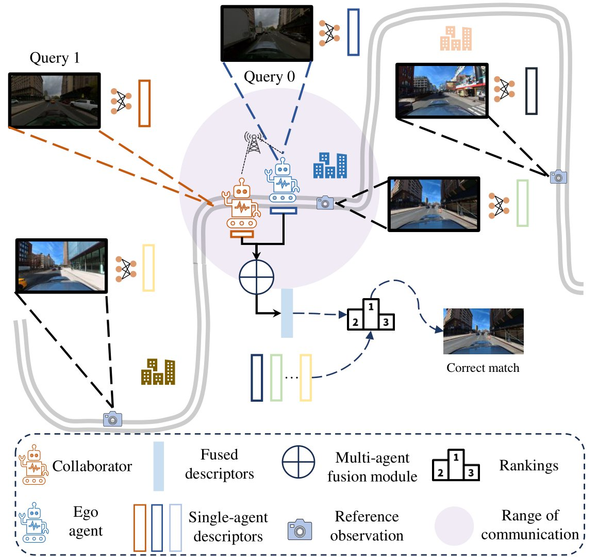
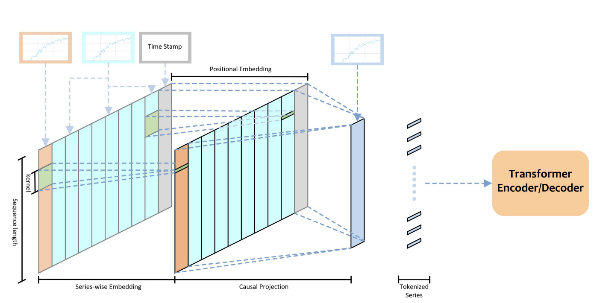

# Publications

<!-- =================================================================================== -->
<table style="width:100%;border:0px;border-spacing:0px;border-collapse:separate;margin-right:auto;margin-left:auto;">
  <tbody>
    
    <tr>
      <td style="margin:5px;padding:5px;width:35%;max-width:90%" align="center" class="image-wrapper">
         
      </td>
      <td width="75%" valign="center" class="text-wrapper"> 
          <papertitle>
            <strong>
              Collaborative Visual Place Recognition
            </strong>
          </papertitle>
           
          Yiming Li*, <strong><u>Zonglin Lyu*</u></strong>, Mingxuan Lu, Chao Chen, Michael Milford, Chen Feng✉️.
             
          submitted to <strong>ICRA</strong> 2024
           
          <a href="https://arxiv.org/abs/2310.05541" class="custom-link—paper">[Paper]</a>
          <a href="https://github.com/ai4ce/CoVPR" class="custom-link—code">[Code]</a>
          <a href="https://ai4ce.github.io/CoVPR/" class="custom-link—project">[Webpage]</a>
      </td>
    </tr>

    <tr>
      <td style="margin:5px;padding:5px;width:35%;max-width:90%" align="center" class="image-wrapper">
         
      </td>
      <td width="75%" valign="center" class="text-wrapper"> 
          <papertitle>
            <strong>
              How Features Benefit: Parallel Series Embedding for Multivariate Time Series Forecasting with Transformer
            </strong>
          </papertitle>
           
          Xuande Feng*, <strong><u>Zonglin Lyu*</u></strong>✉️.
             
          <strong>ICTAI</strong> 2022
           
          <a href="https://ieeexplore.ieee.org/document/10098079" class="custom-link—paper">[Paper]</a>
          <a href="https://github.com/ZonglinL/ParallelSeries" class="custom-link—code">[Code]</a>
      </td>
    </tr>

  </tbody>
</table>

<!-- =================================================================================== -->

---

